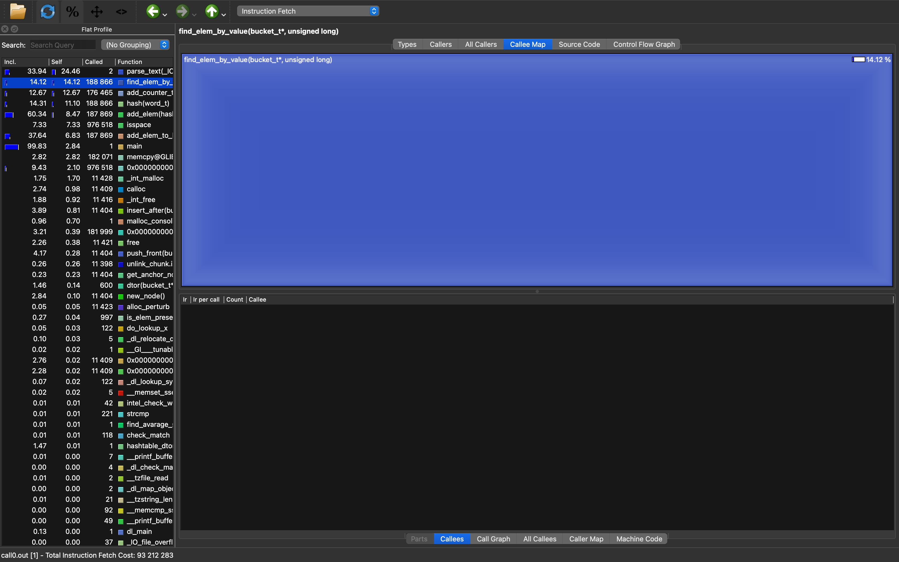
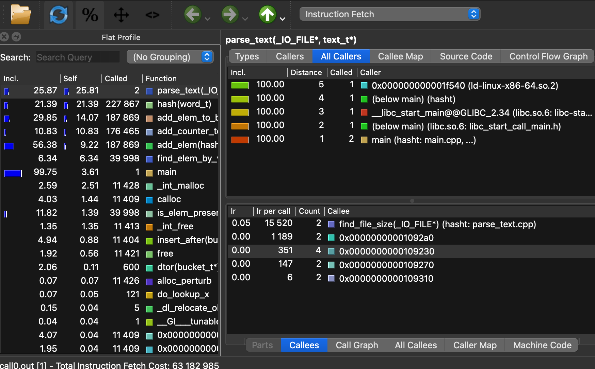
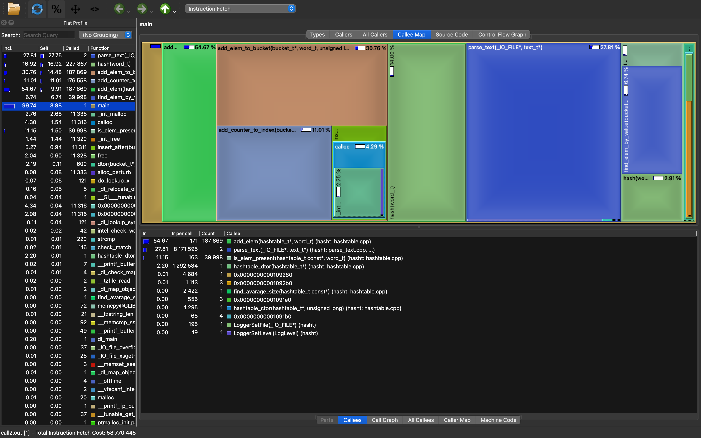
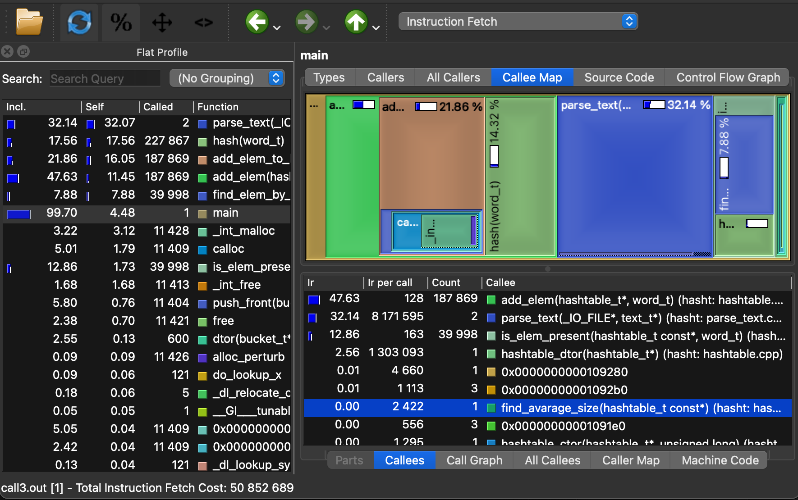

# Hashtable Performance Optimization Project

## Overview

This project focuses on optimizing a program that performs the following tasks (without altering the existing hash function):

- Parses a text file to extract **unique words**.
- Inserts each unique word, along with its frequency, into a **hashtable**.
- Performs **word lookup operations** within the hashtable.

The goal was to improve the program’s performance through profiling and code refactoring, particularly in the context of memory and instruction fetch efficiency.

## Dataset and Configuration

- **Total unique words processed:** 11,400
- **Total number of search queries:** 40,000
- **Number of hashtable buckets:** 600
- **Resulting load factor:** ~19 (Note: this is intentionally high for educational purposes; in practice, a load factor of 1–2 is recommended to improve performance)

## Hashtable Structure

The hashtable is implemented as an array of **doubly-linked lists** (`bucket_t`), where each node contains the following structure:

```c
typedef struct {
    word_t word;
    size_t cnt;
    uint64_t hash;
} elem_t;
```

### Hash Function

The MurmurHash64 algorithm was selected for hashing words. It provides good distribution and speed.


# Profiling and Optimization Process

## Step-by-Step Optimization Procedure

1. Profile the executable:

```bash
valgrind --tool=callgrind ./executable
```

2. Visualize performance metrics using:

```bash
qcachegrind file_name
```

3. Identify and refactor the most expensive functions.

4. Repeat the process until satisfactory performance is achieved.


## Optimization Results

| Metric                   | Value         |
|--------------------------|---------------|
| Initial instruction fetch | 93,212,283    |
| Final instruction fetch   | 50,444,872    |
| Performance Improvement   | **1.85× speedup** |

## Detailed Optimizations

Initial profile:



- **Instruction Fetch Cost:** `93,212,290`
- Note: The function `Parse_text`, part of an external library, was excluded from performance evaluation as it is not part of the target optimization scope.

---

### Targeted Function Optimization: `find_elem_by_value`

#### Original Implementation

```c
ssize_t find_elem_by_value(bucket_t* bucket, uint64_t hash) {
    assert(bucket != nullptr);
    node_t* current_pos = bucket->tail;
    for (size_t i = 1; (i <= bucket->size) && (current_pos != nullptr); i++) {
        if (current_pos->data.hash == hash) {
            return (ssize_t) i;
        }
        current_pos = current_pos->next;
    }
    return -1;
}
```

#### Optimized Implementation

```c
    ssize_t find_elem_by_value(backet_t* backet, uint64_t hash) {
        assert(backet != nullptr);
        node_t* current_pos = backet->tail;
        size_t i = 1;
        while (current_pos) {
            if (current_pos->data.hash == hash) {
                return (ssize_t) i;
            }
            current_pos = current_pos->next;
            i++;
        }
        return current_pos ? (ssize_t) i : -1;
    }
```

- Replaced the `for` loop with a `while` loop to eliminate unnecessary comparison operations (`i <= bucket->size`) and make logic more efficient.

- By consolidating conditional checks into a single loop condition (`while (current_pos)`), the number of conditional jumps executed during iteration was reduced, improving branch prediction accuracy.

- Improved return logic with a conditional (`current_pos ? ...`) to avoid redundant computation.



- **Instruction Fetch Cost After Optimization:** `63,183,000`

---

### Targeted Function: `hash`

This function computes a 64-bit hash value for each word using the MurmurHash64 algorithm. It is performance-critical, as it is invoked during both insertion and lookup operations for every word.

---

### Original Implementation

```c
uint64_t hash(const char* word, size_t len) {
    assert(word != nullptr);

    uint64_t hash = SEED ^ (len * MUL);
    const uint8_t* data = (const uint8_t*) word;
    uint64_t buffer = 0;

    while (len >= 8) {
        memcpy(&buffer, data, sizeof(uint64_t));
        data += 8;
        len -= 8;

        buffer *= MUL;
        buffer ^= buffer >> BIT_SHIFT;
        buffer *= MUL;

        hash ^= buffer;
        hash *= MUL;
    }

    if (len > 0) {
        buffer = 0;
        memcpy(&buffer, data, len);
        hash ^= buffer;
        hash *= MUL;
    }

    hash ^= hash >> BIT_SHIFT;
    hash *= MUL;
    hash ^= hash >> BIT_SHIFT;
    return hash;
}
```

### Optimized Implementation

```c
uint64_t hash(word_t word) {
    assert(word.word != nullptr);

    size_t len = word.len;
    uint64_t hash = SEED ^ (len * MUL);
    const uint8_t* data = (const uint8_t*) word.word;
    uint64_t buffer = 0;

    if (len >= 8) {
        buffer = _mm_cvtsi128_si64(_mm_loadu_si128((const __m128i*)data));
        data += 8;

        buffer *= MUL;
        buffer ^= buffer >> BIT_SHIFT;
        buffer *= MUL;

        hash = (hash ^ buffer) * MUL ;
    }

    len &= 7;
    if (len) {
        buffer = 0;

        switch (len) {
            case 7: buffer |= (uint64_t)data[6] << 48; [[fallthrough]];
            case 6: buffer |= (uint64_t)data[5] << 40; [[fallthrough]];
            case 5: buffer |= (uint64_t)data[4] << 32; [[fallthrough]];
            case 4: buffer |= (uint64_t)data[3] << 24; [[fallthrough]];
            case 3: buffer |= (uint64_t)data[2] << 16; [[fallthrough]];
            case 2: buffer |= (uint64_t)data[1] << 8;  [[fallthrough]];
            case 1: buffer |= (uint64_t)data[0];
        }

        hash ^= buffer;
        hash *= MUL;
    }

    hash ^= hash >> BIT_SHIFT;
    hash *= MUL;
    hash ^=  hash >> BIT_SHIFT;
    return hash;
}
```

### Optimization Techniques Used

Firstly, I rewrite memcpy as
``` c
    asm(".intel_syntax noprefix\n\t"
        "mov rdi, %[dst]\n\t"
        "mov rsi, %[src]\n\t"
        "mov rcx, %[len]\n\t"
        "rep movsb\n\t"
        ".att_syntax prefix\n\t"
        :
        : [dst] "r"(&buffer), [src] "r"(data), [len] "r"(len)
        : "rdi", "rsi", "rcx");

```
However, performance wasn't improved.

So, the following optimizations were made:

- **Replaced `while` Loop with Conditional `if`:**
  The majority of words in the dataset were shorter than 16 bytes. This made loop-based processing for 8-byte chunks redundant. Replacing the `while` loop with a single `if` block reduced control flow overhead and improved branch prediction performance.

- **Introduced SIMD Intrinsic for Fast Memory Access:**
  The original implementation used `memcpy`. The optimized version uses the intrinsic:
```c
  _mm_cvtsi128_si64(_mm_loadu_si128((const __m128i*)data));
```

- Bit-Packed ``switch``. (Optimized by compiler).





- **Instruction Fetch Cost After Optimization:** `50,852,700`

---
### Optimized `add_elem_to_bucket` and `find_elem_by_value`

### Original Implementation

```c
void add_elem_to_bucket(bucket_t* bucket, word_t word, uint64_t hash) {
    assert(bucket != nullptr);
    assert(word.word != nullptr);

    ssize_t index = find_elem_by_value(bucket, hash);
    if (index != -1) {
        add_counter_to_index(bucket, (size_t) index);
    }
    else {
        push_front(bucket, {{word.word, word.len}, 1, hash});
    }
}

ssize_t find_elem_by_value(backet_t* backet, uint64_t hash) {
    assert(backet != nullptr);
    node_t* current_pos = backet->tail;
    for (size_t i = 1; (i <= backet->size) && (current_pos != nullptr); i++) {
        if (current_pos->data.hash == hash) {
            return (ssize_t) i;
        }
        current_pos = current_pos->next;
    }
    return -1;
}

```

### Optimized Implementation

```c
void add_elem_to_bucket(bucket_t* bucket, word_t word, uint64_t hash) {
	assert(bucket != nullptr);
	assert(word.word != nullptr);

	if (find_and_track_elem_by_value(bucket, hash) == -1) {
		push_front(bucket, {{word.word, word.len}, 1, hash});
	}
}

ssize_t find_and_track_elem_by_value(bucket_t* bucket, uint64_t hash) {
	assert(bucket != nullptr);

	node_t* current_pos = bucket->tail;
	size_t i = 1;
    while (current_pos && current_pos->data.hash != hash) {
        current_pos = current_pos->next;
        i++;
    }
	return current_pos ? (ssize_t) current_pos->data.cnt++ : -1;
}
```

- Reduced Redundant Calculations: The original version called find_elem_by_value twice — first to check if the element exists, and second to update or insert the element. The optimized version calls a new function find_and_track_elem_by_value once. This function performs the lookup and, if the element is found, increments the counter directly, avoiding redundant checks.

- Optimized Return Logic with Conditional Ternary Operator: The logic for incrementing the counter and returning the result is streamlined with the use of the ternary operator (current_pos ? (ssize_t) current_pos->data.cnt++ : -1).


